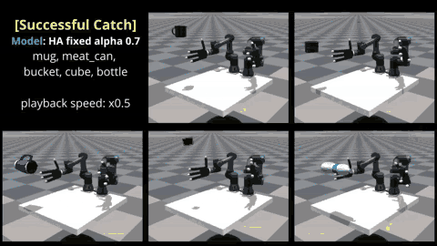
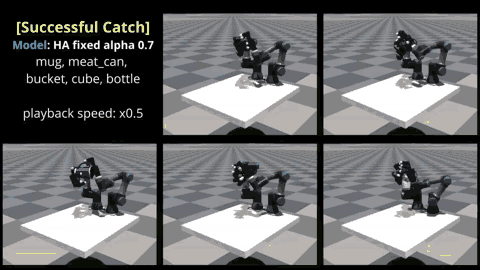

# [ICRA 2025] Learning Dexterous Bimanual Catch Skills through Adversarial-Cooperative Heterogeneous-Agent Reinforcement Learning

[Paper]() | [Videos](https://youtu.be/LbzgZB7IQuY?si=VSCWraJeeeyx7fkY)





## About this Repository
This repository contains the experimental code for the paper *Bimanual Catching Skill Learning*, presented at ICRA 2025. 
The implementation is based on the [IsaacGymBenchmarks](https://github.com/isaac-sim/IsaacGymEnvs) framework and utilizes a custom-built `rl_games_twk` library 
for the heterogeneous-agent reinforcement learning (HARL) version of [rl_games](https://github.com/Denys88/rl_games?tab=readme-ov-file).

## Installation
We highly recommend using a **Conda environment** for setup.

### Step 1: Create and Activate a Conda Environment
Create a dedicated Conda environment for this project:

```bash
conda create --name bicatch python=3.8 -y
conda activate bicatch
```

### Step 2: Install Isaac Gym
Download the Isaac Gym Preview 4 release from the [official website](https://developer.nvidia.com/isaac-gym), then follow the installation instructions in the documentation. 
Ensure Isaac Gym runs correctly by testing an example in the `python/examples` directory, such as:

```bash
python examples/joint_monkey.py
```
If any issues arise, refer to the troubleshooting guide in the Isaac Gym Preview 4 installation instructions.

### Step 3: Install Dependencies and This Repository
Once Isaac Gym is installed and verified, install this repository:

```bash
pip install -e .
```

## Fix for Isaac Gym Compatibility
Modify the `get_axis_params()` function in `isaacgym/python/isaacgym/torch_utils.py`:

🔹 **Change** `dtype=np.float` → `dtype=float`

```python
# Before:
dtype=np.float

# After:
dtype=float
```
This prevents compatibility issues with newer NumPy versions. 🚀

## Configurations
Refer to the following configuration files for training and evaluation of the **Bimanual Catch Skill**.

Some parameters may be duplicated due to the complexity of the code structure.

- **`isaacgymenvs/cfg/config.yaml`**  
  - Defines the task name, PBT usage, number of training environments, max iterations, etc.

- **`isaacgymenvs/cfg/train/BimanualDexCatchUR3AllegroPPO.yaml`**  
  - Specifies whether to use single-agent or multi-agent training, along with other training parameters.
  - **For single-agent training:** Set `params.algo.name: a2c_continuous`
  - **For multi-agent training:** Set `params.algo.name: a2c_multi_agent`

- **`isaacgymenvs/cfg/task/BimanualDexCatchUR3Allegro.yaml`**  
  - Multi-agent parameters: `{uniform test setting, alpha value, alpha decay params, etc.}`
  - Evaluation parameters (e.g., controlled experiments)

## Training
This implementation supports execution via **CLI (Command Line Interface)** but is optimized for use in IDEs like **PyCharm**.  
Adjust the required parameters in the **Configs** section and run:

```bash
python train.py
```

## Testing
Adjust the required parameters in the **Configs** section and run:

```bash
python test.py
```

## Bug Report
If objects unexpectedly reset during testing, modify the following setting:

- Open `cfg/config.yaml`
- Set `sim_device: cpu`

This should resolve the issue.

## Code Structure for Multi(Heterogeneous)-Agent RL
The **Multi(Heterogeneous)-Agent RL** implementation is located in:

📂 `rl_games_twk/algos_torch/a2c_multi_agent.py`

## Citations
*Citations will be added soon!* 🚀

